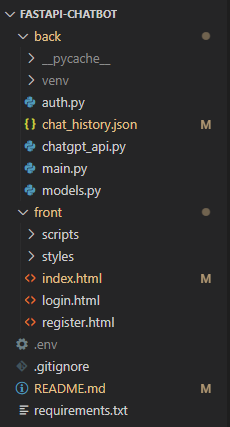

# 🏠 방구석 힐링 챗봇 🤖

## 📝 프로젝트 설명

`방구석 힐링 챗봇`은 일상에 지친 당신을 위한 AI 챗봇 서비스입니다. 사용자들은 로그인 후 챗봇과 대화하며 심리적 안정과 힐링을 얻을 수 있습니다. 모든 대화 기록은 사용자별로 저장되어 언제든지 지난 대화를 불러와 다시 볼 수 있습니다.

-----

## 🎨 와이어프레임


-----

## 📁 폴더 구조



-----

## ✨ 주요 기능

  * **챗봇 대화**: AI 챗봇과 자유롭게 대화하며 힐링 메시지를 주고받을 수 있습니다.
  * **사용자 인증**: 안전한 회원가입 및 로그인 기능을 제공합니다.
  * **대화 기록 저장**: 사용자별로 모든 대화 내용이 자동으로 저장되어 언제든지 다시 확인할 수 있습니다.
  * **직관적인 UI**: Tailwind CSS를 활용하여 깔끔하고 사용자 친화적인 인터페이스를 제공합니다.

-----

## 🛠️ 기술 스택

이 프로젝트는 다음과 같은 기술 스택으로 개발되었습니다.

### 프론트엔드 (Front-end)

  * **HTML5**: 웹 페이지 구조를 위한 마크업 언어
  * **CSS3**: 스타일링을 위한 스타일시트 언어
      * **Tailwind CSS**: 유틸리티 우선(utility-first) CSS 프레임워크로, 빠르고 일관된 UI 개발에 사용
  * **JavaScript (ES6+)**: 클라이언트 측 로직 및 동적 웹 페이지 구현
      * **Axios**: Promise 기반 HTTP 클라이언트로, 백엔드 API와의 통신에 사용

### 백엔드 (Back-end)

  * **Python**: 서버 로직 구현
      * **FastAPI**: 빠르고, 높은 성능의 비동기 웹 프레임워크
      * **Pydantic**: 데이터 유효성 검사 및 설정 관리에 사용
      * **uvicorn**: ASGI(Asynchronous Server Gateway Interface) 서버
  * **OpenAI API**: 챗봇의 핵심 기능인 AI 응답 생성 (ChatGPT)
  * **JSON**: 데이터 저장 및 전송 형식 (채팅 기록 저장)

-----

## 🚀 설치 및 실행 방법

이 프로젝트를 로컬 환경에서 설치하고 실행하는 방법은 다음과 같습니다.

### 📋 필수 요구사항

  * Python 3.8 이상
  * Node.js 및 npm (프론트엔드 빌드 시 필요)
  * Git

### 📦 백엔드 설정 (Python)

1.  **레포지토리 클론**:

    ```bash
    git clone https://github.com/your-username/your-healing-chatbot.git
    cd your-healing-chatbot
    ```

    (만약 레포지토리 이름이 다르다면 위 명령어를 프로젝트 이름에 맞게 수정해주세요.)

2.  **가상 환경 생성 및 활성화**:

    ```bash
    python -m venv venv
    # Windows
    .\venv\Scripts\activate
    # macOS/Linux
    source venv/bin/activate
    ```

3.  **의존성 설치**:

    ```bash
    pip install -r requirements.txt
    ```

    (프로젝트 루트에 `requirements.txt` 파일이 없으면 직접 설치해야 합니다. `fastapi`, `uvicorn`, `python-multipart`, `openai`, `pydantic` 등을 설치해주세요.)

- 작성중...